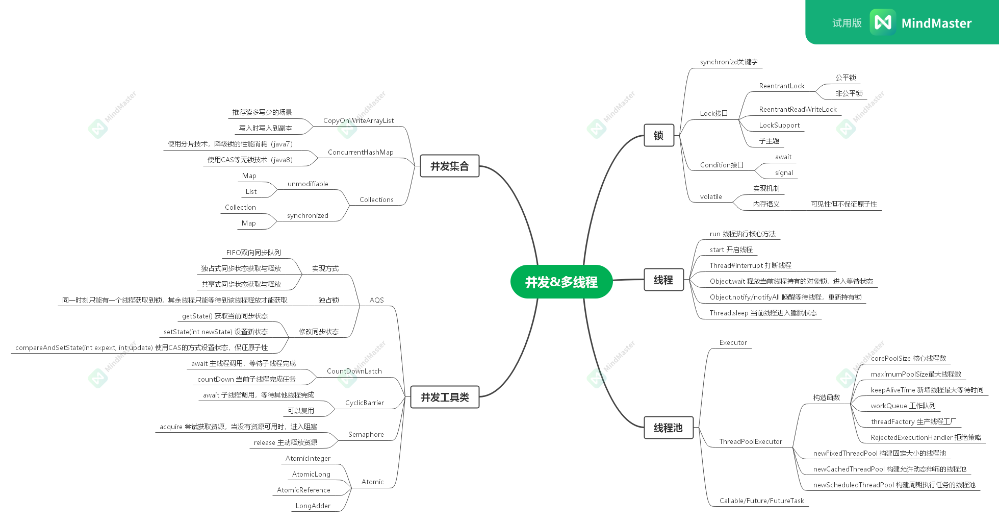

## 1.在 main 函数启动一个新线程，运行一个方法，拿到这个方法的返回值后，退出主线程

[实现代码](./src/main/java/indi/kurok1/HomeWork.java)
共计实现13种
<ol>
    <li>使用阻塞队列实现 {@link HomeWork#runWithBlockingQueue()}</li>
    <li>使用wait的方式实现 {@link HomeWork#runWithWait()}</li>
    <li>使用join的方式实现 {@link HomeWork#runWithJoin()}</li>
    <li>使用interrupt的方式实现 {@link HomeWork#runWithInterrupt()}</li>
    <li>使用Future和Executor的方式来实现 {@link HomeWork#runWithFuture()}</li>
    <li>使用ForkJoinPool的方式来实现 {@link HomeWork#runWithForkJoinPool()}</li>
    <li>使用CompleteFuture的方式来实现 {@link HomeWork#runWithCompleteFuture()}</li>
    <li>使用Condition的方式来实现 {@link HomeWork#runWithCondition()}</li>
    <li>使用ReadWriteLock的方式来实现 {@link HomeWork#runWithReadWriteLock()}</li>
    <li>使用CountDownLatch的方式来实现 {@link HomeWork#runWithCountDownLatch()}</li>
    <li>使用Semaphore的方式来实现 {@link HomeWork#runWithSemaphore()}</li>
    <li>使用CyclicBarrier的方式来实现 {@link HomeWork#runWithCyclicBarrier()}</li>
    <li>使用Park的方式来实现 {@link HomeWork#runWithPark()}</li>
</ol>

## 2.多线程和并发相关知识梳理

